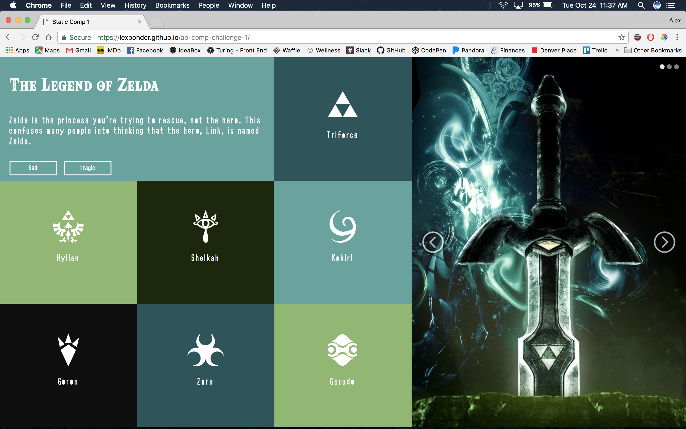

# Static Comp 1 - Alex Bonder - (FE Mod 1)

## Synopsis

This is my take on the static comp 1 challenge.

The part I'm particularly proud of is the fonts and symbols. All of the symbols in the articles are technically text, I found a website that lets you download the font style which changes letters a-s to symbols, I then manipulated them to look good! The header font is the same font used for the design of the game, and the paragraph text is the same style that's seen in the actual gameplay on NES.

I used two different images, one for when the section was vertical and one for when it becomes horizontal. I did not change the color scheme because I think it would be too big of a change at the break point and could be disorienting. Both pictures are easily recognizable by fans of the franchise. 

## Project Goals

* Match the structure of the comp provided
* Make the site responsive

## Installation

Fork or clone this project

Open `index.html`

# Original Comp

# My Comp

